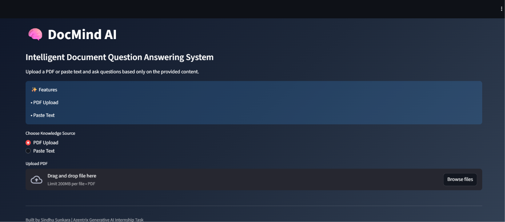
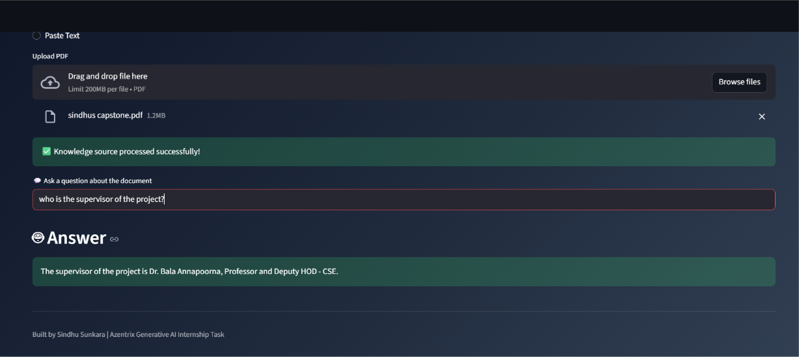

# 🧠 DocMind AI

## Overview

DocMind AI is a Context-Aware Document Question Answering System built using Retrieval-Augmented Generation (RAG).

The application allows users to upload PDF documents or paste text and ask questions based only on the provided content. The system retrieves relevant information from the document and generates accurate answers while preventing hallucinations.

---

## Workflow

PDF Upload / Paste Text

↓

Text Extraction

↓

Text Chunking

↓

Vector Embeddings

↓

ChromaDB Storage

↓

Similarity Retrieval

↓

Groq LLM

↓

Final Answer

---

## Features

* PDF Upload Support
* Paste Text Support
* Text Extraction
* Text Chunking
* Vector Embeddings
* ChromaDB Retrieval
* Groq LLM Integration
* Hallucination Prevention
* Context-Aware Question Answering

---

## Tech Stack

* Python
* Streamlit
* PyPDF
* Sentence Transformers
* ChromaDB
* Groq API

---

## Installation

```bash
pip install -r requirements.txt
```

---

## Run Application

```bash
streamlit run app.py
```

---

## Screenshots

### Home Page



### PDF Upload


### Answer Generation



### Information Not Available


---

## Demo Video

Loom Video:

https://www.loom.com/share/b2220594257548b892d9f25387dd2f7c

---

## Author

Sindhu Sunkara

Azentrix Generative AI Internship Task Submission
